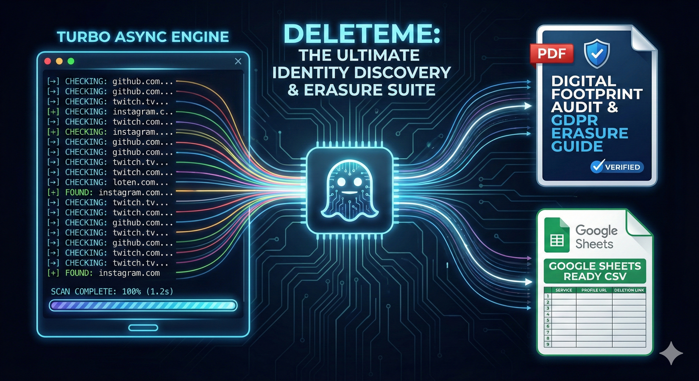

<div align="center">
  <h1>👻 Deleteme v1.1.0</h1>
  <p><b>The High-Performance OSINT Engine for Identity Discovery and Automated Data Erasure.</b></p>
  
  <p>Deleteme is an advanced, asynchronous username scanner designed to identify your digital footprint across 100+ platforms and provide ready-to-use GDPR Article 17 deletion requests.</p>


</div>

---

### 🎯 Mission

**Deleteme** is a proactive OSINT tool focused on digital hygiene. While inspired by projects like Sherlock, our goal is different: **not just to find, but to assist in the complete removal of your online presence.** It automates the tedious process of locating old accounts and provides the necessary legal templates to exercise your "Right to be Forgotten."

---

### ⚡ Quick Start

```bash
# 1. Clone the repository
git clone [https://github.com/surfruit/deleteme.git](https://github.com/surfruit/deleteme.git)
cd deleteme

# 2. Install dependencies
python -m pip install aiohttp fpdf2 colorama

# 3. Run a scan
python -m deleteme.engine your_nickname
```

---

### 🚀 Features

Turbo-Asynchronous Engine: Built with aiohttp to scan hundreds of platforms concurrently in seconds.

GDPR Right to Erasure: Automatically generates GDPR Article 17 request templates for every found profile.

Multi-Format Reporting: Instant generation of PDF, CSV, and TXT audit reports.

Business-Ready: CSV exports are optimized for seamless import into Google Sheets for systematic tracking.

## Privacy-Native: 100% local execution. Your data never leaves your terminal.

### 🛠 Roadmap

[x] High-speed asynchronous username search

[x] Automated GDPR / CCPA deletion request templates

[x] Professional PDF & CSV report generation

[ ] Email-based scanning integration

[ ] Data breach / leak checking (HIBP API)

## [ ] Lightweight local Web UI

### 🤝 Contributing – Adding a New Site

We welcome community contributions to expand our database! To add a service, update deleteme/sites.py:

```SITES_DATA = {
    "SERVICE_NAME": (
        "[https://example.com/user/](https://example.com/user/){}",           # Profile URL template
        "[https://example.com/account/delete](https://example.com/account/delete)"     # Direct deletion link
    ),
}
```

## <p>Then, open a Pull Request with the tag feat: added Example.com support</p>

### 📊 Data Management

## <p>The generated audit_results.csv is designed for privacy professionals who use Google Sheets to track deletion progress across multiple identities.</p>

### ⚖️ License & Disclaimer

<h2>MIT License</h2>
<p>Disclaimer: For lawful use only. This tool is designed for auditing your own accounts or those you have explicit permission to manage. The developers of Deleteme are not responsible for any misuse, ToS violations, or legal issues. Use responsibly. 👻</p>
---
